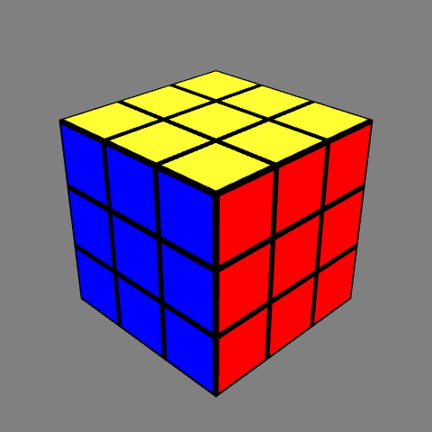

# rubiks-cube-sim

Rubik's Cube Simulator using just python



## Installation

### Dependencies
Recommended **python version: 3.8**
- numpy
- quaternion
- pyglet

Use pip to install these packages (`python3 -m pip install <package_name>`)

### Setup

Clone this repository using following command<br>
`git clone https://github.com/VismayVakharia/rubiks-cube-sim`

## Usage

Run `main.py` to start the cube simulation

### Parameters

| Parameter | Default value | Explanation |
| --- | :---: | --- |
| WIN_W | 640 | Width of the GUI window |
| WIN_H | 640 | Height of the GUI window |
| CUBE_SIZE | 3 | Rubik's cube size: NxNxN |
| COMMANDS | `[]` | List of moves |
| PAUSED | False | Whether to start the simulation paused |
| RECORDING | False | Whether to record the simulation |

### Control

| Command | Action |
| --- | --- |
| F &#124; R &#124; U &#124; B &#124; L &#124; D | Respective face turns | 
| M &#124; E &#124; S | Respective slice turns | 
| X &#124; Y &#124; Z | Respective whole-cube rotations |
| Space | Pause/Unpause simulation |
| Backspace | Reset the cube orientation |
| Click & Drag | Rotate the orientation of the cube |
| Mouse Scroll | Zoom in/out |

Note: Uppercase letters rotate clockwise and lowercase do counter-clockwise.

### Recording
If the `RECORDING` flag is set `True`, animation frames will be saved to `frames/` directory.

To convert these frame to:
- **gif**:
  ```shell
  cd frames/
  convert -delay 5 -loop 0 `ls -v` output.gif
  ```
- **mp4**:
  ```shell
  cd frames/
  ffmpeg -framerate 25 -i %d.png -c:v libx264 -profile:v high -crf 20 -pix_fmt yuv420p output.mp4
  ```

## Notes:

Rotation Notations: [website](https://www.randelshofer.ch/rubik/vcube6/doc/supersetENG_6x6.html)
